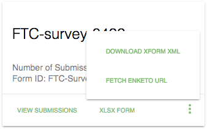

# Enketo-Express integration configuration

[Enketo-express](https://github.com/kobotoolbox/enketo-express) offers the ability to open and submit OpenRosa XForms in an interactive web page.
With this integration, you can open OpenMapKit forms in a custom instance of enketo-express. Once you've got an
enketo-express instance up and running, update the configuration located [here](../jekyll/js/forms/forms.js)

##### enabled
`true` to enable, `false` (default) to disable

##### omk_url
url of OpenMapKit Server instance - i.e. `127.0.0.1:3210`

##### url

url of enketo-instance [post-survey API route](https://apidocs.enketo.org/v2/#/post-survey) - i.e. `127.0.0.1:8005/api/v2/survey`

##### api_key

enketo-express api key
    

When enabled, you will see this button located in the form card menu

Selecting this option fetches the url used to open the selected form in enketo-express. Afterwards, you will be prompted to OPEN the form in a new tab.

