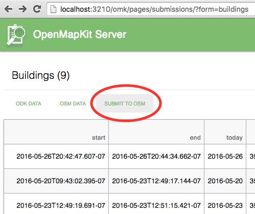

# Submitting OSM Changesets

OpenMapKit Server integrates nicely with both POSM and OpenStreetMap. It functions as an OpenDataKit Aggregation server, 
collecting ODK submission from ODK Collect and OpenMapKit Android. Part of that [submission data](https://github.com/AmericanRedCross/OpenMapKitServer/tree/master/data/submissions)
are OpenStreetMap XML representing the edits made in OpenMapKit Android. This data is in the [JOSM OSM XML](http://wiki.openstreetmap.org/wiki/JOSM_file_format) 
format, and each individual edit can be
opened in [Java OpenStreetMap](https://josm.openstreetmap.de/). 

We have built OpenMapKit Server to work in conjunction with POSM's OSM API as well,
and part of the workflow is to submit OSM data received by OpenMapKit Server to POSM
for further editing and validation. This is done automatically by the default
configuration is POSM is present on the installation.

## Configuration

OpenMapKit Server can submit OSM changesets to any OpenStreetMap API.
Currently, you set up your OSM credentials in the [settings.js](https://github.com/AmericanRedCross/OpenMapKitServer/blob/master/settings.js) 
file. If you have a POSM OSM API on the same box, the default setting
will work unaltered.

```js
osmApi: {
    server: 'http://osm.posm.io',
    user: 'POSM',
    pass: ''
}
```

You can, however, submit to the main OpenStreetMap.

```js
osmApi: {
    server: 'https://www.openstreetmap.org',
    user: '<your-user-name>',
    pass: '<your-password>'
}
```

## Automatic Submission

As submissions roll in from ODK Collect, OpenMapKit Server will attempt
to submit to the configured OSM API a changeset of the OSM data received
on a per-submission basis--__1 changeset per ODK submission.__

The [attempt is made automatically](https://github.com/AmericanRedCross/OpenMapKitServer/blob/7cc4638d8cf691ede1bbcc46ef955481ab34733e/api/odk/middlewares/save-media.js#L60-L62) 
if you have OSM credentials entered in the `settings.js`.

If the POSM or OpenStreetMap service is not availible, or you have conflicts
in your data, you can later resubmit manually.

## Manual Submission

The following REST endpoint will attempt to submit all of the JOSM OSM XML
in your form's submissions directory that has not yet been submitted.

    http://{{your_host_url}}/omk/odk/submit-changesets/<form_id>

You can do this by clicking on __Submit to OSM__ in the Submissions page.



Data that has not been submitted successfully or with a conflict will
be retried. If you do have a conflict in your data. You can resubmit
it by fixing the OSM XML and removing the `conflict.json` file from
the submission directory.
